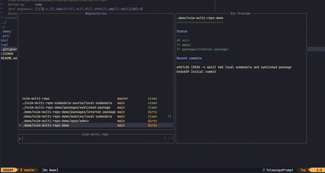

# nvim-multi-repo

A lightweight Neovim fuzzy picker for nested, symlinked and multi-repository Git projects.

`nvim-multi-repo` finds Git repositories inside the current project and lets you choose one from a Telescope picker.

<p align="center">
  
</p>

It is useful when a project contains multiple repositories, for example:

* nested Git repositories
* Git submodules
* symlinked packages
* extra local packages inside a larger workspace

## Features

* Finds multiple Git repositories in one project
* Supports nested repositories, submodules and symlinks
* Uses Telescope as the picker UI
* Opens quickly and loads repository status in the background
* Shows branch, clean/dirty state and ahead/behind info
* Shows Git status and recent commits in preview
* Can fetch or pull all discovered repositories
* Lets you define what happens after selecting a repository

## Requirements

* Neovim
* Git
* [telescope.nvim](https://github.com/nvim-telescope/telescope.nvim)

## Installation

Using `lazy.nvim`:

```lua
return {
    "Miklakapi/nvim-multi-repo",
    dependencies = {
        "nvim-telescope/telescope.nvim",
    },
    config = function()
        require("multi_repo").setup()

        vim.keymap.set("n", "<leader>mr", "<cmd>MultiRepo<cr>", {
            desc = "Open multi-repo picker",
        })

        vim.keymap.set("n", "<leader>mf", "<cmd>MultiRepoFetch<cr>", {
            desc = "Fetch multi-repo repositories",
        })

        vim.keymap.set("n", "<leader>ml", "<cmd>MultiRepoPull<cr>", {
            desc = "Pull multi-repo repositories",
        })
    end,
}
```

## Usage

Run:

```vim
:MultiRepo
```

Select a repository from the Telescope picker.

Repository status is loaded asynchronously, so the picker can open immediately even in large multi-repository workspaces.

By default, the plugin only shows a notification with the selected repository. Use `on_select` to define your own action.

To update discovered repositories, run:

```vim
:MultiRepoFetch
```

or:

```vim
:MultiRepoPull
```

`:MultiRepoFetch` runs `git fetch --all --prune` for discovered repositories.

`:MultiRepoPull` runs `git pull --ff-only` for discovered repositories and shows a summary when it finishes.

## Example with vim-fugitive

```lua
return {
    "Miklakapi/nvim-multi-repo",
    dependencies = {
        "nvim-telescope/telescope.nvim",
        "tpope/vim-fugitive",
    },
    config = function()
        require("multi_repo").setup({
            on_select = function(repository)
                vim.cmd("topleft new")

                local temporary_window = vim.api.nvim_get_current_win()

                vim.cmd("lcd " .. vim.fn.fnameescape(repository.git_root))
                vim.cmd("Git")

                if vim.api.nvim_win_is_valid(temporary_window) then
                    vim.api.nvim_win_close(temporary_window, true)
                end
            end,
        })

        vim.keymap.set("n", "<leader>mr", "<cmd>MultiRepo<cr>", {
            desc = "Open multi-repo picker",
        })

        vim.keymap.set("n", "<leader>mf", "<cmd>MultiRepoFetch<cr>", {
            desc = "Fetch multi-repo repositories",
        })

        vim.keymap.set("n", "<leader>ml", "<cmd>MultiRepoPull<cr>", {
            desc = "Pull multi-repo repositories",
        })
    end,
}
```

This opens Fugitive for the selected repository.

## Configuration

```lua
require("multi_repo").setup({
    scanner = {
        max_depth = 4,
        follow_symlinks = true,

        ignored_dirs = {
            ".git",
            "node_modules",
            "vendor",
            "dist",
            "build",
            ".cache",
        },

        include_dirs = {},
    },

    updater = {
        concurrency = 2,

        fetch_args = {
            "fetch",
            "--all",
            "--prune",
        },

        pull_args = {
            "pull",
            "--ff-only",
        },
    },

    on_select = function(repository)
        vim.notify(
            "Selected repository: " .. repository.display_path,
            vim.log.levels.INFO
        )
    end,

    telescope = {
        layout_strategy = "horizontal",

        layout_config = {
            width = 0.9,
            height = 0.75,
            preview_width = 0.45,
        },
    },
})
```

## Include extra directories

Use `scanner.include_dirs` when some repositories are outside the normal scan depth or inside ignored directories.

```lua
require("multi_repo").setup({
    scanner = {
        include_dirs = {
            "packages/custom-package",
            "/absolute/path/to/another/repo",
        },
    },
})
```

## Customize updater commands

By default, `:MultiRepoFetch` runs:

```bash
git fetch --all --prune
```

and `:MultiRepoPull` runs:

```bash
git pull --ff-only
```

You can customize the Git arguments:

```lua
require("multi_repo").setup({
    updater = {
        concurrency = 2,

        fetch_args = {
            "fetch",
            "--all",
            "--prune",
        },

        pull_args = {
            "pull",
            "--ff-only",
            "--autostash",
        },
    },
})
```

## Customize highlights

By default, highlight groups are linked to your current colorscheme diagnostic groups.

```lua
require("multi_repo").setup({
    telescope = {
        highlights = {
            MultiRepoStatusClean = {
                fg = "#9ece6a",
            },

            MultiRepoStatusDirty = {
                fg = "#e0af68",
                bold = true,
            },

            MultiRepoStatusDeleted = {
                fg = "#f7768e",
            },

            MultiRepoStatusUntracked = {
                fg = "#7aa2f7",
            },
        },
    },
})
```

## Repository object

The `on_select` callback receives a repository object:

```lua
{
    name = "repo-name",
    path = "/path/to/repo",
    real_path = "/resolved/path/to/repo",
    git_root = "/path/to/git/root",
    display_path = "relative/path",
    source = "directory",
    status = {
        branch = "main",
        is_dirty = true,
        changed_count = 1,
        staged_count = 0,
        untracked_count = 2,
        conflict_count = 0,
        added_count = 0,
        modified_count = 1,
        deleted_count = 0,
        renamed_count = 0,
        copied_count = 0,
        ahead = 0,
        behind = 0,
    },
}
```

`status` is loaded asynchronously and may be `nil` when the repository is selected before background status loading finishes.

